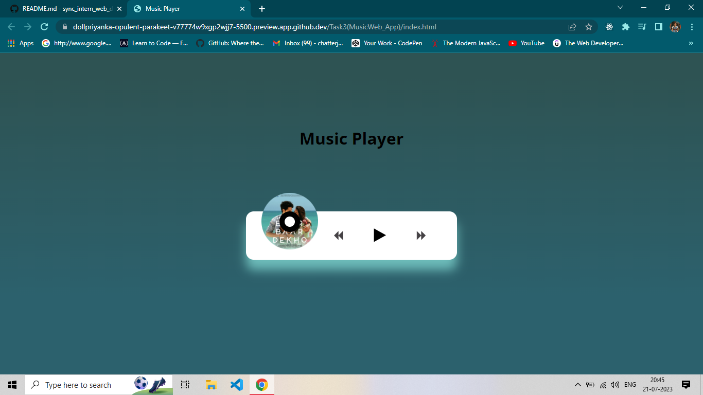

## MusicWeb_App

```sh
This music player will have all the features found in a typical music player. You will be able to add, play, pause and seek songs that have been added
```

* IDE – Visual Code Studio. 
* Skills Required – HTML, CSS, Javascript.

* Screenshots are:




